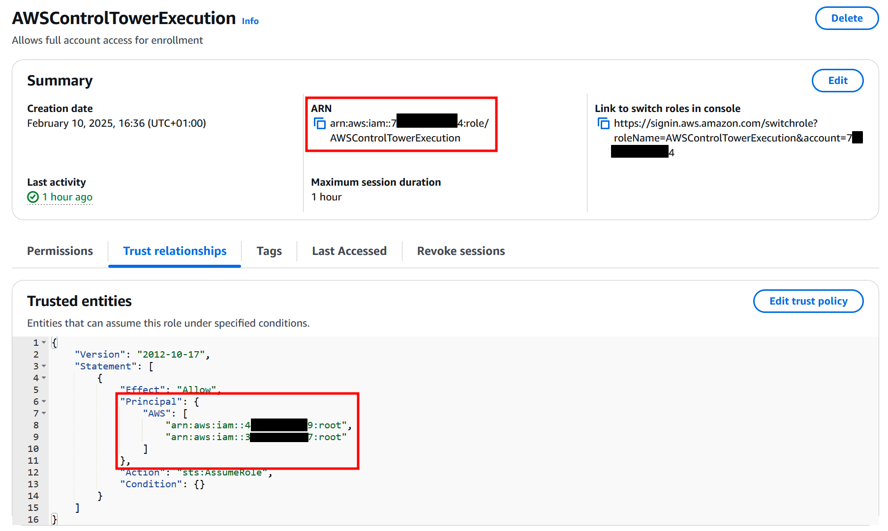
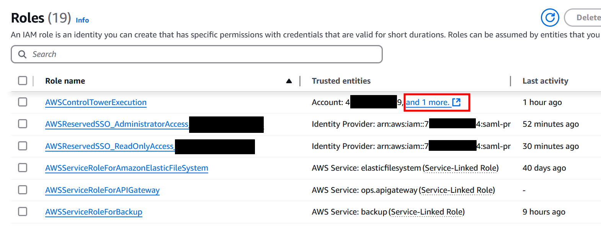
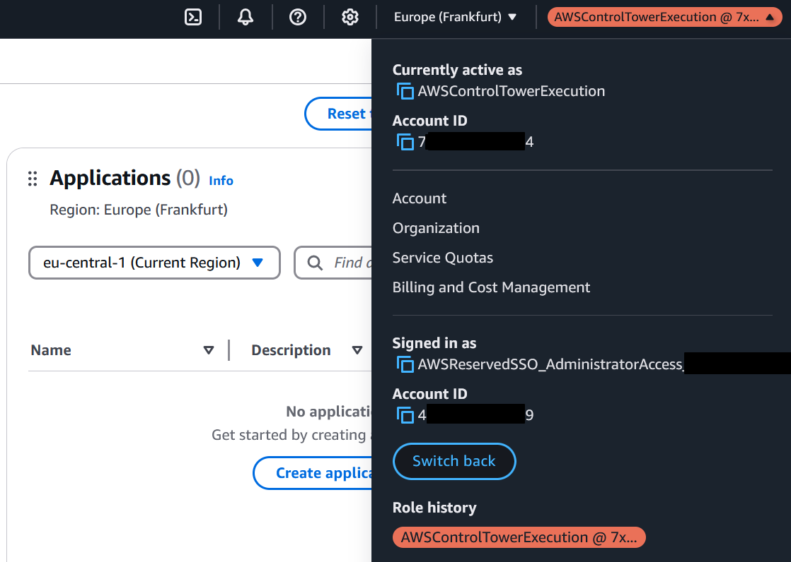

# The Cat Flap

Hi, these are the bonus things that did not make it into the blogpost -> link.

# Bonus

We use the following account IDs throughout the post:

|||
|--|--|
|Attacker Account|`4xxxxxxxxxx9`|
|Target Account|`7xxxxxxxxxx4`|
|Management Account|`3xxxxxxxxxx7`|

## What happens, if the role already exists?

We just add our attacker account, too:

If someone is already hunting, this might not go unnoticed - emphasis on might:

Assuming this role still works fine (yes, this is a fresh screenshot, not just the one from above):

Annotation: If we test again with prowler, there is no difference to be seen in the test results.

## Annotation: How to improve the prowler checks

There are two checks that could be integrated with `prowler` to detect our catflap. Both rely on the fact that AWS Control Tower has to be run from the management account of the AWS Organization.

With the `organizations:DescribeOrganization` action, one can always get the account ID of the current AWS Organizations management account:

![[notetaking_resources/attachments/Pasted image 20250210202008.png]]

This could be used to sanity check all policies in the otherwise muted Control Tower resources.

Prowler states in the documentation that at least the following policies should be attached to the principal running the tests ([prowler documentation](https://docs.prowler.com/projects/prowler-open-source/en/latest/getting-started/requirements/#authentication)):

* `arn:aws:iam::aws:policy/SecurityAudit`
* `arn:aws:iam::aws:policy/job-function/ViewOnlyAccess`

The action `organizations:DescribeOrganization` is allowed in the `SecurityAudit` policy ([AWS documentation](https://docs.aws.amazon.com/aws-managed-policy/latest/reference/SecurityAudit.html)), since `organizations:Describe*` is allowed.

Thus, implementing this should not be an issue.

Furthermore, as soon as more than one account are stated in the trust policy, there is something fishy going on, so this should be flagged, too.
