# Research into the AWSControlTowerExecution role

We use the following account IDs throughout the post:

|||
|--|--|
|Attacker Account|`4xxxxxxxxxx9`|
|Target Account|`7xxxxxxxxxx4`|
|Management Account|`3xxxxxxxxxx7`|

## Setting up the catflap

To set up the catflap, we follow this official AWS documentation to enroll an existing account manually into ControlTower:

https://docs.aws.amazon.com/controltower/latest/userguide/enroll-manually.html

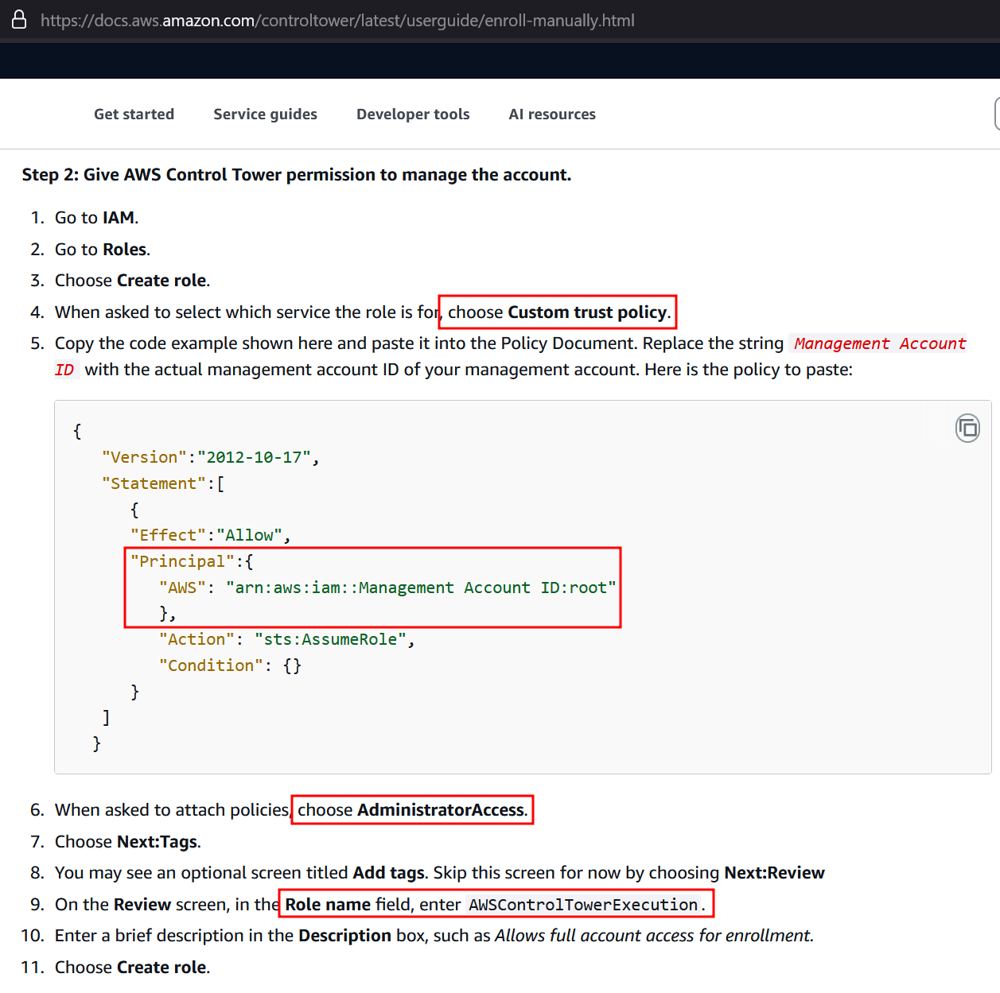

``` json
{
    "Version": "2012-10-17",
    "Statement": [
        {
            "Effect": "Allow",
            "Principal": {
                "AWS": "arn:aws:iam::<attacker_account_id>:root"
            },
            "Action": "sts:AssumeRole",
            "Condition": {}
        }
    ]
}
```

Rolename: `AWSControlTowerExecution`

This is what it looks like when done:

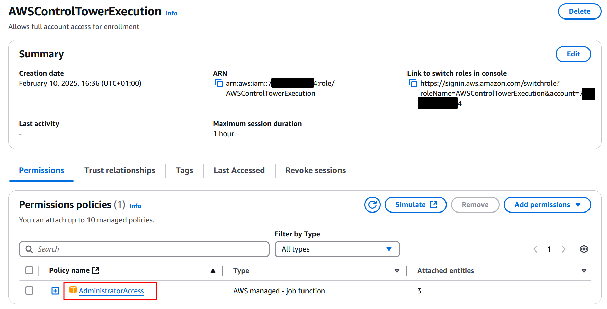

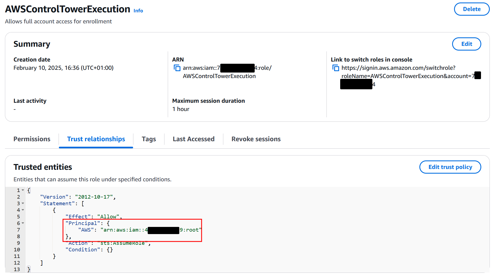

Blends right in, doesn't it?

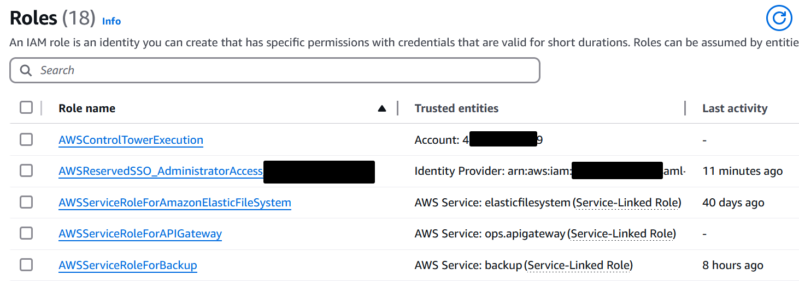

## Using the catflap

Assuming this role from the attacker account works flawlessly, as expected:

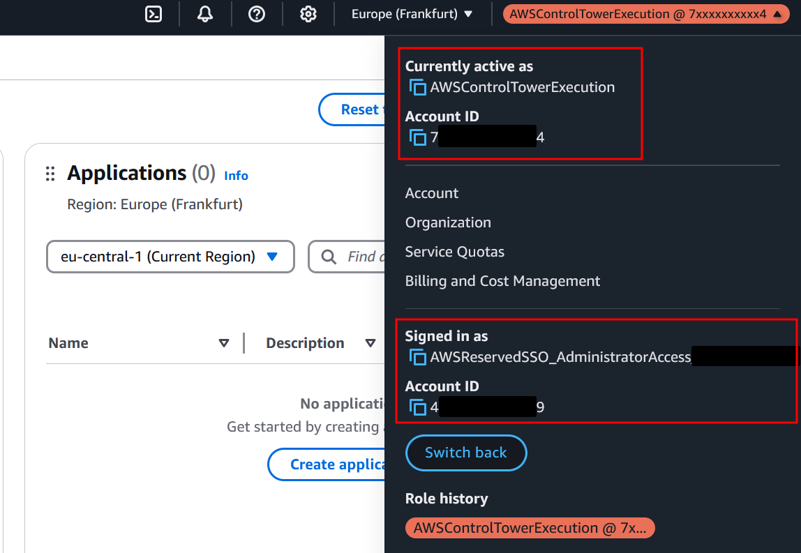

## (Not) detecting the catflap with prowler

To add to this, a default install of the awesome `prowler` and usage without any modifications will ignore resources belonging to Control Tower, because they are allowlisted (docu allowlist: https://docs.prowler.com/projects/prowler-open-source/en/v3/tutorials/allowlist/#):

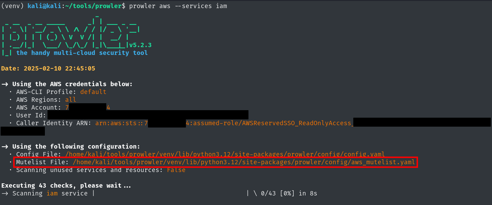

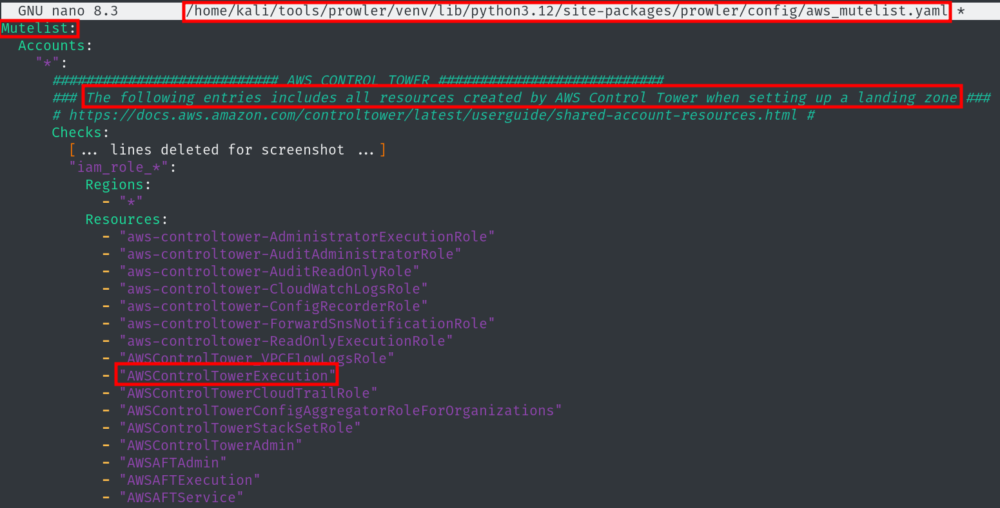

To have a benchmark, we add a role `1337_backdoor` with otherwise the same trust policy and attached `AdministratorAccess` policy:

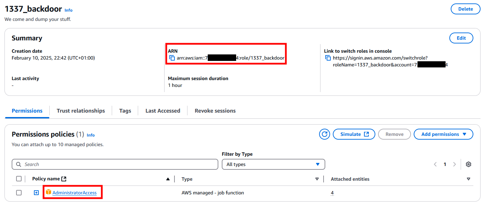

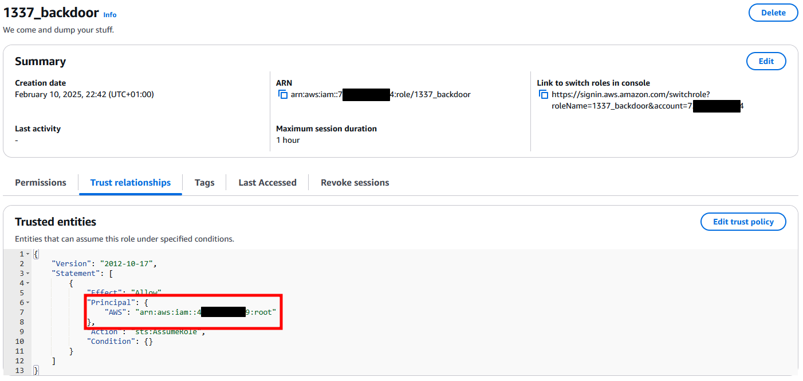

And this is the result of the scan, filtered for the check that lists all roles that have `AdministratorAccess` attached to them as "fail" (check `iam_role_administratoraccess_policy`, https://docs.prowler.com/checks/aws/iam-policies/iam_23/):

1. The `1337_backdoor` role got flagged
2. The `AWSControlTowerExecution` role is connected to a failed control, but muted

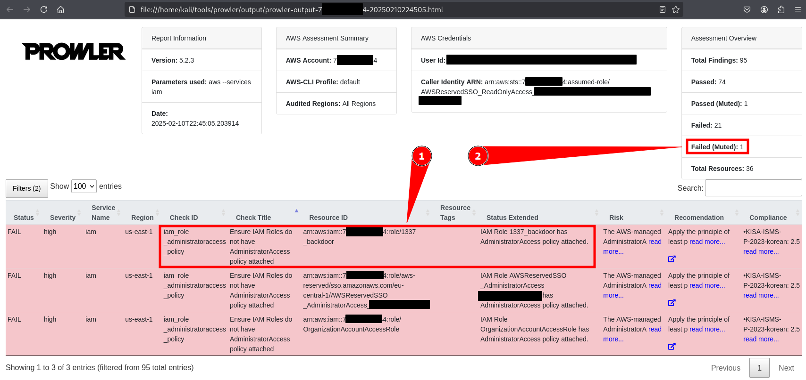

In theory, this can be filtered for, but who does that?

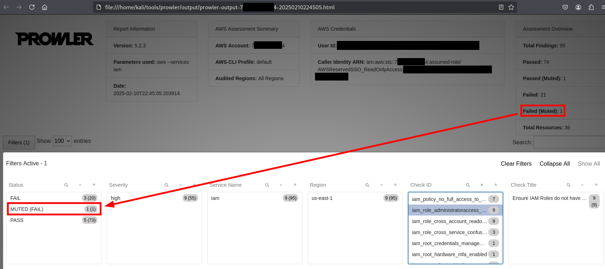

Quite nice, eh?

## What happens, if the role already exists?

> @rootcat: We should probably check if that works, see paragraph [[#Todo]]. This is especially crucial, since AWS detects drift on the roles and might remediate that. The question is, what is the baseline for the drift?

But what happens, if the role already exists? We just add our attacker account, too:

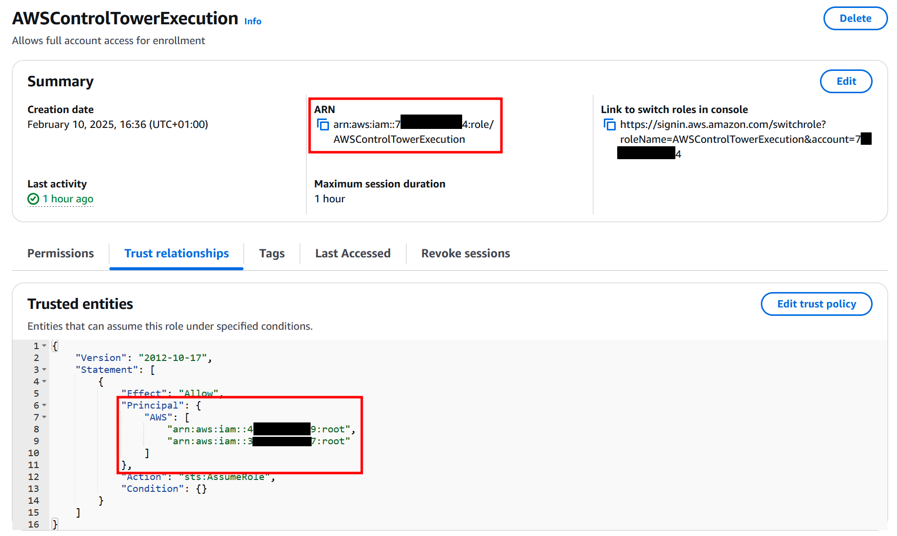

If someone is already hunting, this might not go unnoticed - emphasis on might:

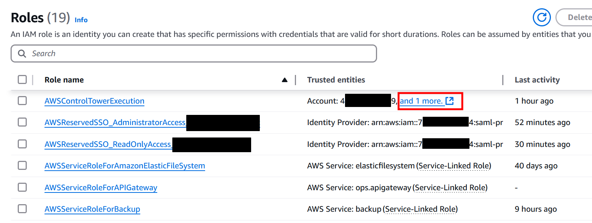

Assuming this role still works fine (yes, this is a fresh screenshot, not just the one from above):

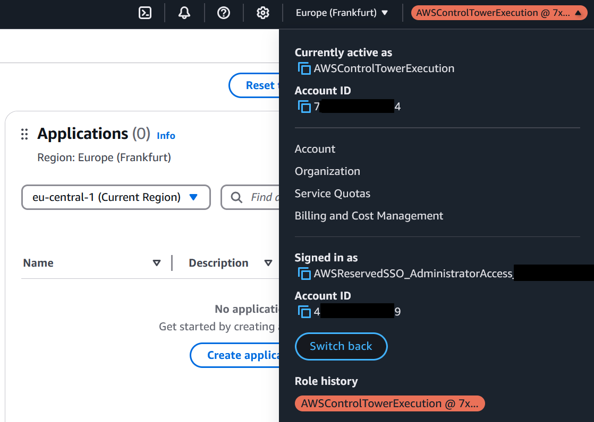

Annotation: If we test again with prowler, there is no difference to be seen in the test results.

## Annotation: How to improve the prowler checks

> @rootcat, should we raise this with prowler, before we publish the blog post? If they opt for implementing this, cool! If not, we have a statement for the post. But since this is not an issue on their side, but basically a feature request, we might just publish anyways and update, if we have an update.

There are two checks that could be integrated with `prowler` to detect our catflap. Both rely on the fact that AWS Control Tower has to be run from the management account of the AWS Organization.

With the `organizations:DescribeOrganization` action, one can always get the account ID of the current AWS Organizations management account:

![[notetaking_resources/attachments/Pasted image 20250210202008.png]]

This could be used to sanity check all policies in the otherwise muted Control Tower resources.

Prowler states in the documentation that at least the following policies should be attached to the principal running the tests ([prowler documentation](https://docs.prowler.com/projects/prowler-open-source/en/latest/getting-started/requirements/#authentication)):

* `arn:aws:iam::aws:policy/SecurityAudit`
* `arn:aws:iam::aws:policy/job-function/ViewOnlyAccess`

The action `organizations:DescribeOrganization` is allowed in the `SecurityAudit` policy ([AWS documentation](https://docs.aws.amazon.com/aws-managed-policy/latest/reference/SecurityAudit.html)), since `organizations:Describe*` is allowed.

Thus, implementing this should not be an issue.

Furthermore, as soon as more than one account are stated in the trust policy, there is something fishy going on, so this should be flagged, too.

## Googling for AWSControlTowerExecution

When starting a VPN and using a fresh Incognito Window, this is what we see when we just google for `AWSControlTowerExecution`:

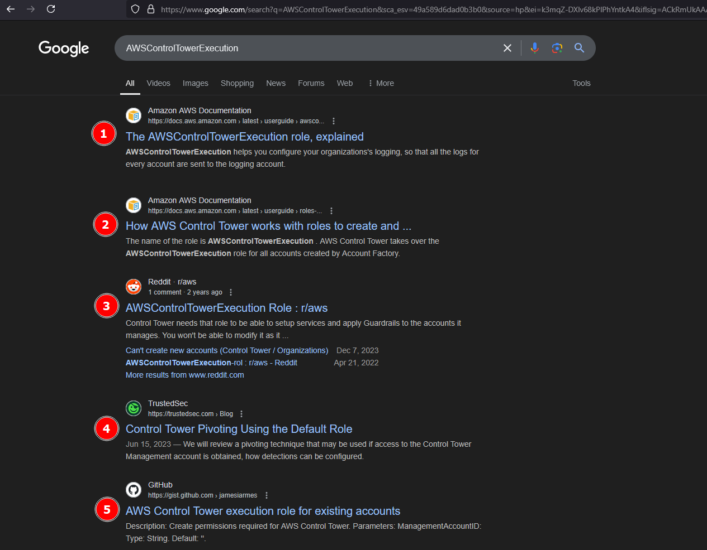

1. https://docs.aws.amazon.com/controltower/latest/userguide/awscontroltowerexecution.html
	- An introduction to the role, how it gets created and what it is being used for.
	- 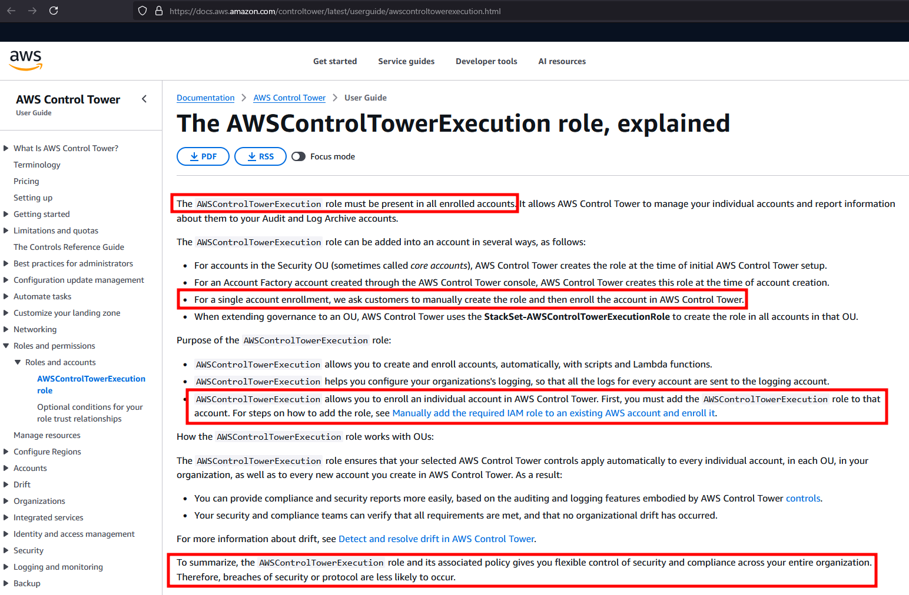
2. https://docs.aws.amazon.com/controltower/latest/userguide/roles-how.html
	- An overview about all roles used by Control Tower
	- 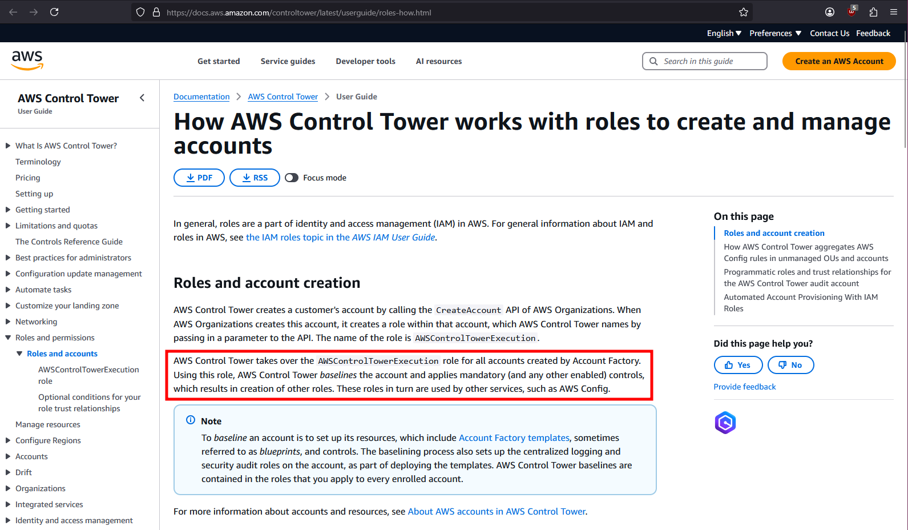
3. https://www.reddit.com/r/aws/comments/u8x7tx/awscontroltowerexecution_role/
	- A redditor is in exactly the shoes we imagine a snoopy developer on the victims side to be in. His J1 (JupiterOne?) complains about the role's permissions and he tries to find out what the role does and if he can take away some permissions. Instead of AWS, he asks Reddit. The first (and only) helpful person tells him that the role should be there, all is good, and don't touch it. Perfect.
	- 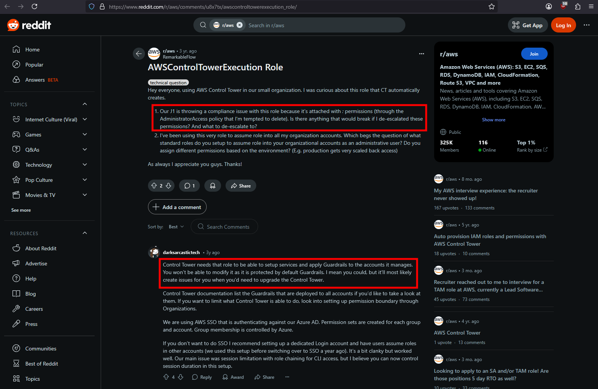
4. https://trustedsec.com/blog/control-tower-pivoting-using-the-default-role
	- Blog post from trustedsec about pivoting from management account to member accounts using this role. Nice remediation in there, but the article does not mention the persistence vector abusing the role at all. It just says "someone can use the role, but only for an hour, but in this time they can set up persistance".
	- 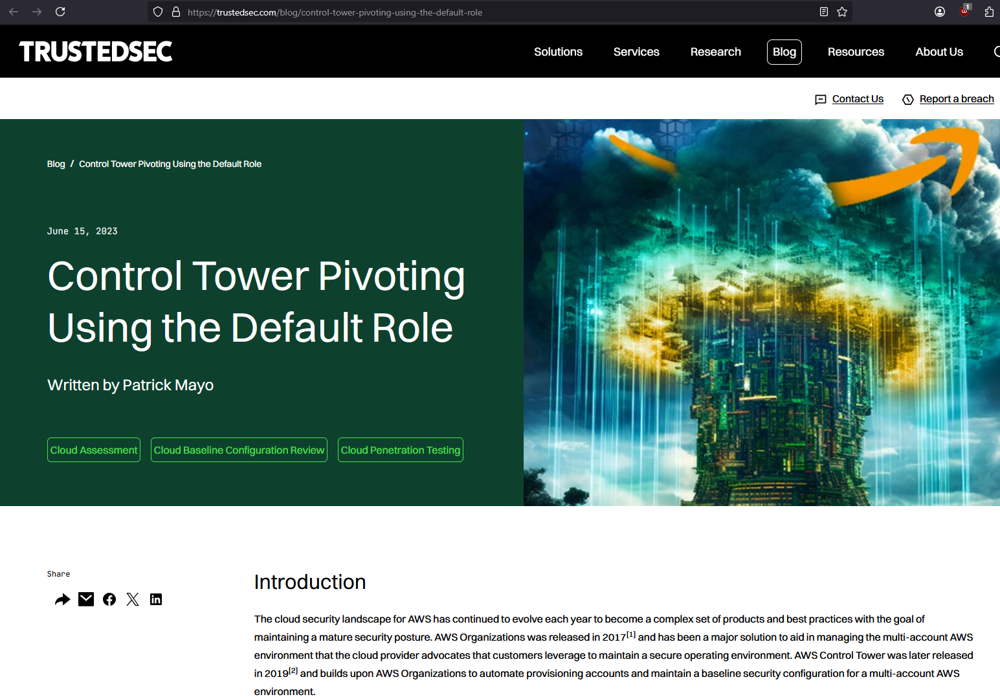
5. https://gist.github.com/jamesiarmes/878dac85e2593ec348a230116f036054
	- Someone giving the world a GH Gist with the role setup as yaml file. Also nice.
	- 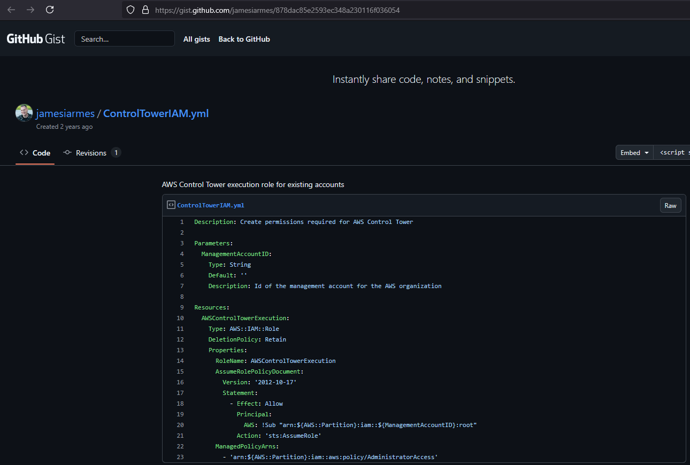

## Todo

> @rootcat: Maybe we should use an external account as the attacker account? I do not think that AWS has checks in place in the backend, but just to be close to reality? Probably wasted time, though.

If we find the time, we could/should do the following (might be incomplete, please check):

1. Take an Org without Control Tower and create an empty account.
2. In this account, create the `AWSControlTowerExecution` role as described above, but with the legitimate management account and an attacker account as trusted.
	1. Szenario: We put the catflap in, and later the Org actually wants to use Control Tower, but the person responsible for deploying the roles does not understand that this is a malicious backdoor, but just adds the management account ID as well (unlikely, but hey).
3. Introduce Control Tower and enroll the account from step 2.
	1. Check: does AWS raise any alarms here about the two accounts in the trust policy?
4. Create a new account using Control Tower. This automatically creates the `AWSControlTowerExecution` role there.
	1. Check: Can we add our attacker account as second ID, as described above? Is this somehow blocked? Does it impair functionality? (Unlikely, but hey)
	2. Check: Does AWS detect the drift (they claim that yes) and remediate this? Can we trigger this drift check and see what happens? How often does this run if left alone?

## In memoriam Barsik

Und hier noch das Bild von meinem Kater Barsik, eventuell kannst du es ja irgendwo passend verwursten, gerne auch mit Memecaption :)

Auf dem Screen sind keine Geheimnisse, nur CTF stuff.

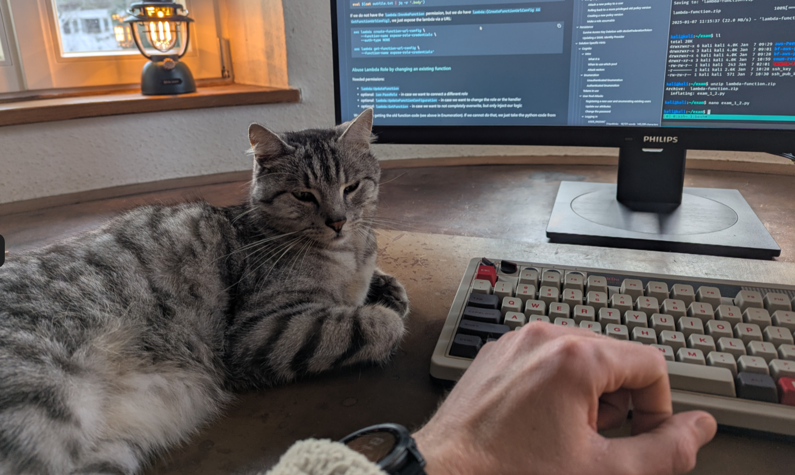
